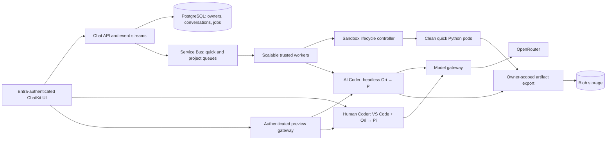

> For the enterprise rollout sequence and security prerequisites, start with [Azure implementation](AZURE-IMPLEMENTATION.md) and [enterprise hardening](ENTERPRISE-HARDENING.md). The local Pi capability is readable by code; the separate trusted harness is required before claiming managed-agent-only LLM access.

# AKS execution platform draft

Revision 2026-09-06. This is an implementation plan and configuration sketch; no Azure resources have been deployed. Preserve automatic routing, the quick/project execution adapters and independent human workstations. Move scheduling and state behind them into durable services before adding users.

## Architecture

Human and AI workspaces retain separate identities, provisioner permissions, namespaces and homes. Coder agents provide workspace connectivity; the native Coder engine can keep headless inference in its control plane, while optional Ori/Pi runs inside a workspace. GUI Pi/Ori remains a separate credential-reuse exception. Quick Python has no coding-agent startup, model credential or package downloads. Keep the existing Azure session-pool service behind the quick adapter as a measured comparison and migration rollback option.

## Four scaling layers

| Layer | Proposed policy | Zero behavior |
|---|---|---|
| Trusted job workers | Queue backlog, oldest wait, active leases; KEDA plus fair admission | Zero after assigned jobs drain |
| Quick pods | Active leases plus unclaimed clean reserve; dedicated controller | Zero outside prewarm windows without demand |
| Persistent workspaces | Resume owned home; stop idle compute; retain storage separately | Zero when no jobs, users or previews remain active |
| Execution user node pools | AKS Cluster Autoscaler responds to unschedulable requested pods | Minimum zero with drain-compatible workloads |

Keep system nodes and a services tier available for API, KEDA, lifecycle controller, Coder and preview routing. Production system pools require at least two nodes; start with three for availability. User pools support zero. The always-on tier has a floor cost even when execution is zero. [AKS system/user pools](https://learn.microsoft.com/en-us/azure/aks/use-system-pools).

Use tainted execution pools for quick, AI projects and human workspaces, with selectors/tolerations and realistic CPU/RAM requests. Match architecture, ACR image digest, storage and validated runtime class. Pool maxima must fit regional vCPU quota, IP space and budget. Pending pods trigger node growth; work hidden only in an app queue does not. Do not use multiple controllers independently setting node counts. [AKS Cluster Autoscaler](https://learn.microsoft.com/en-us/azure/aks/cluster-autoscaler-overview).

## Warm-start policy and traffic

Measure active execution capacity and unclaimed ready reserve independently. Minute-bucket execution counts can describe demand shape but do not establish allocation rate. It does not show fresh allocation rate, subminute bursts, allocated-idle sessions, duration or memory. Weekly users is also not a concurrency measure.

Collect representative weeks of arrivals, reuse, execution duration, pod/image/PVC readiness, CPU/RSS and queue age. Forecast weekday/time-of-day demand, fitting Tuesday–Thursday separately from Monday/Friday and weekends. Track growth and forecast error. Use America/New_York with daylight saving unless the application's actual user region differs.

For each image/resource profile, use this starting policy:

`ready target = clamp(0, maximum, max(schedule floor, arrival rate × tail refill time + burst allowance))`

The schedule floor ends outside its window; reactive demand still wakes capacity overnight and weekends. Prewarm before the ramp by measured p95 node provisioning + image pull + sandbox readiness. A cached image, a ready pod and a resumed project are different latency states. Validate the formula against burst replay, not just mean arrivals.

Illustration: 2 new allocations/second × 4 seconds refill + 4 burst slots suggests 12 ready pods. These inputs are hypothetical. A 92 peak × 1.5 growth × 1.25 headroom yields a **173 concurrent-execution load-test scenario**, not a recommended live cap or node count. Add retained running projects, reserve, runtime overhead and system resources separately.

Start experiments with 2–5 minute quick cooldown and 5–10 minute node consolidation delay. Tune project idle timers against resume cost: initially 5 minutes AI, 10 minutes human. Show impending human stop and retain direct Coder IDE activity detection. Active previews renew forwarding leases and count as activity.

Zero reserve and zero execution nodes accepts a cold first request. Scheduled prewarming reduces that during predictable peaks; it cannot eliminate unexpected overnight cold starts. Continuous off-hours activity correctly prevents full scale-down.

## Durable jobs and safe drains

Do not replicate the current in-process job queue, SQLite store and single pool controller. Separate API/event subscriptions from workers. Store events/results in PostgreSQL/Blob and deliver jobs via Service Bus. Serialize turns by conversation while allowing different conversations concurrently; enforce per-user/project fairness and global bounds.

Each job needs an idempotency key, renewable lease, fencing generation, cancellation record and terminal state. The lifecycle controller reconciles after crashes and owns pods through a controller resource. Only a clean unclaimed environment can be warm capacity. Used quick pods are destroyed; owned projects resume only for their owner.

Scale demand from queued **and leased** work. On SIGTERM, stop dequeuing and drain or checkpoint before releasing ownership. Renew message locks during long work. Handle duplicate delivery and lock loss without automatically replaying arbitrary code. A PDB or cooldown alone does not protect an in-flight worker from application scale-down. The example scaler requires an active-work metric and implemented drain protocol.

Atomically mark only unclaimed pods retiring before deletion. Protect active execution from routine consolidation; release protection on completion. Reap orphans using expired fenced leases and reconcile outputs first. Unmanaged bare pods can block node drain indefinitely; do not carry that local controller pattern directly into production. Workspace stop removes compute and retains the volume. Exercise cancellations, worker loss, node drain and rolling upgrades before traffic migration.

## Images, packages and storage

Keep a small prebuilt quick scientific image. Promote common missing packages through image releases. Split the current all-language persistent image into proposed analysis (Python/Julia), web (JS/.NET), and native (C/C++/Go/Rust) profiles, with a full-toolchain human option. These profiles are not implemented locally yet. Pin digests/SDK versions and prefetch verified layers before the ramp.

uv is the Python manager throughout. npm, NuGet, Julia Pkg, Go modules and Cargo remain their language managers. Local C/C++ uses preinstalled compilers and approved source; add curated Conan/vcpkg feeds only when needed. Share trusted immutable downloads/mirrors; keep environments and writable caches owner-specific. The local read-only gateway now filters release age and caches public artifacts, with durable artifact IDs for lockfile restores.

Use encrypted owner-scoped Blob objects for artifacts/datasets. Benchmark Azure Disk for build trees and small-file caches; account for attach latency, topology and concurrent-writer constraints. Evaluate Azure Files where shared access is required. Select CSI binding/topology and capacity controls explicitly. Local-path PVCs cannot migrate from this Mac to arbitrary nodes. Preserve runtime/image metadata and lockfiles; do not copy native caches across architectures.

Retained-project budgets are separate from compute limits. Agree storage quotas, inactivity notices, backups and retention before automatic deletion. Stopping compute does not reclaim storage charges. Coder prebuilt workspaces can reduce provisioning if licensed; the documented feature requires Premium and is not enabled in this Community prototype. [Coder prebuilt workspaces](https://coder.com/docs/admin/templates/extending-templates/prebuilt-workspaces).

## Identity, measurement and rollout

Apply Entra authorization to each conversation, workspace, file and preview. Use managed identities for Azure services and authenticated HTTPS previews on a separate origin. Keep provider keys in the model gateway. Keep model capabilities out of native headless code. For GUI capabilities, use renewable scopes and durable revocation/audit; message counts cannot distinguish agent inference from programmatic use. Replace local-owner cookies and administrator bootstrap. Validate isolation, runtime compatibility, egress/DNS and provisioner RBAC on actual AKS nodes.

Measure p50/p95/p99 for model inference, admission wait, pod acquire, node start, image pull, imports, volume attach/restore, Pi execution and artifact delivery separately. Track warm hits, oldest queued job, active/idle capacity, lease failures, memory/disk, package misses, cost per completed task and drain blockers. Alert on maxima/quota failures and show queued work clearly.

Roll out: durable ownership/jobs/storage → one validated AKS execution pool → warm controller and zero-to-burst replay → multi-pool fairness/forecasting/failure tests → gradual migration compared with current Azure sessions. Verify cross-owner isolation, independent conversations, no duplicate execution after lease loss and no active-pod deletion during scale-down.

## Configuration sketches

[Worker scaling example](../infra/aks/scaling.example.yaml) combines queue demand, active-work metrics and positive weekday floors. The queue can grow past a scheduled floor and wake zero workers outside business hours. Do not use cron `desiredReplicas: 0` to implement off-hours zero. [KEDA Service Bus](https://keda.sh/docs/2.18/scalers/azure-service-bus/), [KEDA cron semantics](https://keda.sh/docs/2.18/scalers/cron/).

[Sandbox pool policy](../infra/aks/pool-policy.example.yaml) is a future controller contract, not configuration read by the local backend. Values are illustrative, not estimates derived from the photo. Examples follow the KEDA 2.18 schema; check the actual supported AKS add-on version, federated identity and metrics integration before deployment. No Azure resources have been created.

## Developer chat, app hosting and optional personal storage

The local UI now routes automatically, with no Quick/Analysis/App toggle. The developer IDE uses upstream Pi Chat 0.2.3 (pinned MIT source), configured through Ori and the same gateway as headless workspaces. Its capability can be read by the workspace user; the provider key remains in trusted control. Use Entra identities, short-lived capabilities and per-user accounting in AKS.

App previews currently forward to a server in the original coding workspace. Clicking the app resumes its workspace and replays its saved launch recipe without invoking a model. Closing the view releases activity; workspace idle cleanup later stops compute and retains its home. For apps that should remain independently available, add a distinct Publish workflow: validate a static artifact or container build, assign its own runtime identity, and deploy to a separate hosting workload with explicit retention, access and scale-to-zero policies. Do not implicitly keep development workspaces alive as production app servers.

Keep Blob as the proposed default checkpoint/artifact store. Optional OneDrive synchronization would run in a trusted Graph broker, checkpoint source and lockfiles from a Linux working volume, track per-project remote revisions, and detect external-edit conflicts. Never synchronize credentials or package caches. Retain unsynced data on failures; resume by hydrating source and restoring dependencies. OneLake is an optional governed analytical dataset source. These storage adapters are proposals, not connected services. The [architecture guide](ARCHITECTURE-GUIDE.md) specifies permissions, conflict detection, durability and resume behavior with Microsoft source links.

## Restricted egress and package admission

Carry the local default-deny model into AKS: isolated execution pools, internal-only DNS, separate trusted model and package gateways, and owned Coder connectivity. Do not restore general GitHub access or unrestricted HTTPS CONNECT. Test both direct IP and DNS paths on the chosen AKS networking mode. Credentials for registries, Graph, Blob and MCP belong in trusted brokers with managed identities, not coding pods.

Replace the experimental package facade with maintained curated mirrors for each needed ecosystem. Enforce at least five days since trustworthy publication; otherwise quarantine immutable content from first observation. A reviewed mirror can accumulate inventory before users need it, avoiding Go/Julia's first-use wait. Promote common approved dependencies into versioned images. Scan and record artifact hashes, provenance, license and age decisions; support signed policy releases and recursive revocation. Keep a human exception workflow for exact versions/hashes, with an expiry and reason. Use Entra roles rather than the prototype's local-owner admin screen. Never let an agent grant itself an exception.

MCP is a separate allowlisted route: use an approved-server catalog (Azure API Center is a candidate) plus an enforcing gateway that validates identity, destination and permitted operations. A catalog alone does not prevent arbitrary network access. Server tools such as Exa web search through OpenRouter remain approved model egress; apply query/payload audit, per-user budgets and data handling policy there. Additional use-case internet access should be an explicit, scoped policy, not a blanket namespace rule.

Observe p95/p99 package gateway latency, cache hits, quarantined requests, unknown package attempts, blocked DNS/egress and exception usage alongside compute metrics. A pool with warm pods but missing or quarantined dependencies is not application-ready capacity. Validate real uv/npm/Cargo/NuGet/Go/Julia restore behavior across gateway restarts and cluster upgrades.

## Current lifecycle and security revision

Quick reserve: five idle minutes, unassigned to any conversation. Used pods are destroyed. Quick source, artifacts and bounded working-file snapshots persist locally; no cloud storage is configured. A multi-language Coder project is allocated only when the AI calls `delegate_project`. AI projects stop after five idle minutes, human workstations after ten, subject to active work and recent visible interaction. Background connections and status polling do not count. Pi Chat defaults to the right secondary sidebar and uses Ori → Pi → the trusted OpenRouter gateway. There is no package-name whitelist; only exact, expiring age exceptions. Live pod snapshots refresh every five seconds. See [the updated field guide](ARCHITECTURE-GUIDE.md) for enforcement, data paths, local credential scope and production gaps.

The local broker also keeps at most one **clean unassigned Coder project reserve** during new-chat demand. Only explicit `delegate_project` claims it. Used project homes never return to the reserve. It counts against total workspace capacity, stops after five idle minutes, and retains its unused clean home. The reserve is exposed in Lab status; set `PROJECT_WARM_RESERVE=0` to disable or `PROJECT_RESERVE_IDLE_SECONDS` to tune. AKS should replace this single-broker ledger with durable atomic leases and a demand-sized controller.
