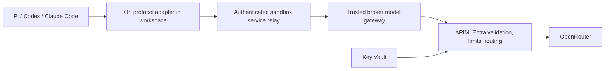

# Routing Ori through Azure API Management

Prepared for operations, 2026-09-13. This is a configuration and implementation plan, not a claim that APIM is deployed. Examples use placeholders only. No APIM, Key Vault, firewall or private endpoint is provisioned by this document.

## Recommended topology



Keep Ori pointed at the existing local gateway. Change the trusted gateway's upstream to APIM. A workspace continues to receive only its short-lived, workspace-bound capability; it never receives the OpenRouter key or an APIM-wide credential. APIM adds centralized policy and observability, while the broker retains per-workspace model authorization, provider policy and budget admission.

This is distinct from attaching a managed identity to an untrusted workspace. Giving a workspace the broker's identity would let arbitrary project code exercise that identity. Prefer identity on the trusted broker that calls APIM, with a narrowly scoped app role.

## Current implementation and work required

| Component | Current behavior | Change for APIM |
|---|---|---|
| `sandbox/harness_setup.py`, Ori templates | Configure Pi, Codex and Claude against local protocol endpoints | Keep local addresses and short-lived capability flow |
| `backend/azure_services.py` | Validates the capability against the exact workspace, applies model budget admission | Preserve these checks |
| `sandbox/gateway.py` | Hard-coded `https://openrouter.ai/api/v1/…`, upstream provider key held by trusted process | Add administrator-only fixed APIM base URL and Entra token acquisition; do not accept an upstream URL from workspace input |
| `backend/chat.py`, `backend/azure_agent.py` | Main chat and broker headless engine call OpenRouter directly | Route these too only if the operational goal includes all inference |
| `backend/workspace_models.py` | Gets model catalog directly from OpenRouter | Decide whether public catalog reads stay direct; if routing via APIM, expose the required GET route |
| Speech routes in `sandbox/gateway.py` | Transcription plus model endpoint/ZDR discovery use separate upstream paths | Include explicitly if dictation is in scope; do not assume the three coding routes cover it |

There is currently **no working `APIM_BASE_URL` switch** in this repository. Adding an environment variable without implementing the gateway change will not route traffic. Suggested future settings: fixed HTTPS `MODEL_UPSTREAM_BASE_URL`, `MODEL_UPSTREAM_AUTH=entra`, and `MODEL_UPSTREAM_SCOPE=api://<api-app-id>/.default`. These are proposed names, not supported configuration today. Validate the URL at startup; prohibit credentials, queries, fragments and redirects. Cache and refresh access tokens before expiry. Keep the provider key out of requests sent by the broker once APIM owns it.

## Authentication and authorization

1. Register an Entra application representing the APIM inference API. Give it an application role such as `Inference.Invoke`, assignable to applications.
2. Give the trusted broker a managed identity when hosted on Azure. Assign only that app role to its service principal. On a local workstation, use an explicitly registered development client/credential; a local process does not acquire an ACA managed identity automatically.
3. Request a token for `api://<api-app-id>/.default`. Configure APIM to validate the actual audience emitted for that application/token version, the tenant, calling client application ID, and the `Inference.Invoke` role. Test actual claims rather than assuming that the scope string equals the `aud` claim.
4. Store the OpenRouter provider key as a Key Vault secret. Enable APIM's managed identity and grant it only the needed secret access. Add a secret named value `openrouter-provider-key` referencing the versionless secret URI. Account for Key Vault firewall/network reachability and secret refresh delay.
5. APIM replaces the incoming Entra bearer token with the OpenRouter bearer key only on the provider-bound request. OpenRouter does not authenticate this call with the broker's Entra token.

A subscription key is an alternative for an initial controlled integration, but it is a reusable secret, not a workload identity. If used, retain it only in the trusted broker and rotate it. Do not configure APIM with authentication disabled as a convenience.

Sources: [Entra token validation](https://learn.microsoft.com/en-us/azure/api-management/validate-azure-ad-token-policy), [Key Vault-backed named values](https://learn.microsoft.com/en-us/azure/api-management/api-management-howto-properties).

## API operations and path mapping

Create a blank HTTP API with URL suffix `ori/v1`. Register only the operations needed, rather than an unrestricted wildcard proxy. Set the backend base URL to `https://openrouter.ai/api/v1`.

| APIM public route | Backend route | Caller |
|---|---|---|
| `POST /ori/v1/chat/completions` | `/api/v1/chat/completions` | Pi |
| `POST /ori/v1/responses` | `/api/v1/responses` | Codex |
| `POST /ori/v1/messages` | `/api/v1/messages` | Claude Code |
| Optional `GET /ori/v1/models` | `/api/v1/models` | Trusted catalog refresh only; workspaces normally receive broker-filtered catalog |

Use the exact operation-relative URL templates `/chat/completions`, `/responses`, `/messages`. Verify the composed backend URL in APIM diagnostics with a synthetic request. Preserve JSON tool definitions, tool results, model IDs, reasoning parameters and SSE payloads. This is protocol forwarding, not a conversion of all clients to Chat Completions.

Illustrative API-level policy follows. Replace named values with your identifiers. Configure each operation as above. Validate it in your chosen APIM tier and inspect inherited policy before deployment.

```xml
<policies>
  <inbound>
    <base />
    <validate-azure-ad-token tenant-id="{{entra-tenant-id}}"
        header-name="Authorization" failed-validation-httpcode="401">
      <client-application-ids>
        <application-id>{{broker-client-id}}</application-id>
      </client-application-ids>
      <audiences><audience>{{inference-token-audience}}</audience></audiences>
      <required-claims>
        <claim name="roles" match="any"><value>Inference.Invoke</value></claim>
      </required-claims>
    </validate-azure-ad-token>
    <set-backend-service base-url="https://openrouter.ai/api/v1" />
    <set-header name="Authorization" exists-action="override">
      <value>Bearer {{openrouter-provider-key}}</value>
    </set-header>
    <set-header name="Ocp-Apim-Subscription-Key" exists-action="delete" />
    <set-header name="x-api-key" exists-action="delete" />
  </inbound>
  <backend>
    <forward-request timeout="180" buffer-response="false" follow-redirects="false" />
  </backend>
  <outbound><base /></outbound>
  <on-error><base /></on-error>
</policies>
```

Add request-size, request-rate and concurrency controls appropriate to the chosen tier and expected traffic. Do not apply Azure OpenAI-specific token policies to an OpenRouter Messages/Responses payload without testing compatibility. A shared broker identity makes APIM's per-client counters aggregate across users; per-user/workspace budgets remain in the broker unless you add trusted, authenticated attribution. Never trust arbitrary client-supplied workspace headers for charging or access.

## Streaming, timeouts and retry behavior

Set `buffer-response="false"`; avoid body-reading outbound policies and logging payload bodies. Check every intermediate load balancer and proxy. APIM timeout limits and idle connection behavior still apply; an advertised timeout is not a guarantee that every tier or intermediary holds a silent connection that long. See [SSE configuration](https://learn.microsoft.com/en-us/azure/api-management/how-to-server-sent-events) and [forward-request](https://learn.microsoft.com/en-us/azure/api-management/forward-request-policy).

The current sandbox relay awaits an ASGI response and forwards its buffered body in `backend/azure_services.py`. Therefore **APIM configuration alone will not deliver token-by-token streaming to workspace tools**. To improve first-token latency, the relay needs incremental response forwarding, backpressure, cancellation and final-usage handling; test this separately from changing the upstream endpoint. Do not claim an APIM streaming benchmark validates that relay path.

Do not automatically retry a model POST after a timeout or partial response. The provider may have accepted and billed it, and an agent might act twice. Return a safe error/correlation ID, preserve the run history, and reconcile before any retry. Read-only catalog operations can use bounded backoff.

## Operations acceptance checks

- Correct client identity succeeds; wrong tenant, audience, app role and expired token fail. A workspace capability presented directly to APIM fails.
- Each of the three routes completes a plain response and a local tool-call round trip. Verify provider model ID and usage where returned.
- Streaming requests deliver initial and final events intact, cancellation closes the connection, and the gateway does not retry a partial response.
- Size/rate limits fail with a useful bounded response; concurrent users cannot bypass broker budgets with custom model IDs.
- Rotate the Key Vault secret and verify propagation before retiring the old key. Inspect logs to ensure bearer tokens, prompts, code and tool arguments are absent.
- Use synthetic correlation IDs plus route, model, duration, HTTP status and provider usage for routine diagnostics. Record missing usage as unavailable, not zero.
- Run a canary workspace for Pi, Codex and Claude; retain direct-upstream rollback configuration in the trusted deployment only. Keep rollback explicit and audited, not an automatic bypass of APIM policy.

## Network and cost decisions

A public APIM endpoint with Entra validation may be sufficient for the pilot. Private connectivity requires a tier/network design that supports the intended ingress and egress; it is not automatically supplied by the sandbox egress policy. Choose region near the broker/provider path and measure the extra hop. Reuse an existing approved APIM instance where practical; assess throughput/concurrency and tier-specific features before provisioning a new one. APIM, Key Vault, networking and logging can add charges; no new fixed-cost service is authorized by this analysis.

## Registry dependency note

The pilot's headless/developer disk images were imported from the private registry. Their current disk-image state is Ready, but the registry remains the source for rebuilds and re-imports. The built-in Python pool does not need a custom registry image. Do not delete the only retained custom-image source until an alternate source/archive is verified and a clean replacement image can be imported. Existing running sandboxes alone are not evidence of rebuild independence.
