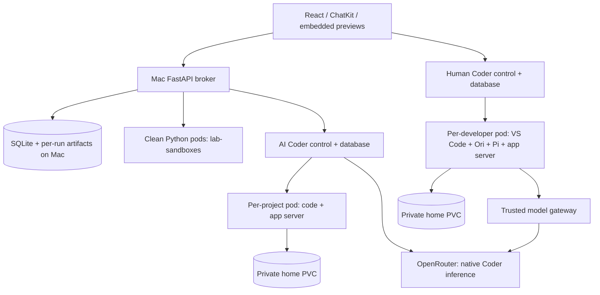

# Sandbox Lab: execution, storage and lifecycle

Configuration reference, 7 September 2026. The local implementation is running on this Mac. AKS, independent app publishing and OneDrive/OneLake storage are proposals; they have not been deployed or connected. The interactive version is available as **Sandbox Lab — Architecture field guide** in the main application's Apps gallery and its seeded reference conversation.

## The user experience

Chat routes automatically. There is no Quick/Analysis/App selector. Small Python calculations and charts use clean disposable compute; a missing package, substantial analysis or app development requires the AI to call `delegate_project`. Only that handoff allocates a conversation project. Merely creating, reading or chatting in a conversation never creates one. “Analysis” and “app” describe work inside that same project environment rather than two different user-facing environments. An existing project is reused for follow-ups. Routing is model-directed and can make mistakes; the tool results and execution record show what actually ran.

Developer workspaces are independent. A person opens VS Code, files, terminal and app previews from the sidebar. Chat's coding tools do not execute in that person's workstation. Inside VS Code, upstream Pi Chat defaults to the right secondary sidebar, with streaming responses, expandable tool calls, Markdown, diffs, file mentions, history, model/reasoning controls, New chat and Stop. The local `coder-native` trial runs headless inference in the Coder control plane; its workspace receives only file/shell operations. Developer workstations still use Pi through Ori. `ori-pi` remains a selectable headless alternative; see [native Coder trial](NATIVE_CODER_TRIAL.md).

## Taxonomy

| Thing | Runs where | Starts when | Stops when | What survives |
|---|---|---|---|---|
| Main chat and broker | React browser UI; FastAPI on the Mac | Local launcher starts | Launcher/backend stops | SQLite conversations, results and artifact files |
| Quick Python call | A clean pod in `lab-sandboxes` | Tool call claims a ready pod or waits for one | Every call destroys its pod; 30-second execution limit | Local source, exported artifacts and bounded working-file checkpoints; restored only to that conversation |
| Clean quick reserve | Unused pods from the quick image | Chat demand wakes the adaptive pool | Reserve goes to zero after 300 seconds without demand | Nothing mutable; used pods are never returned to another user |
| Clean project reserve | One ordinary Coder workspace in `lab-agents`, unassigned | New-chat routing warms it; explicit delegation claims it once | Stops after five idle minutes; clean standby home retained | No conversation data or model allowance before claim |
| AI project / analysis | One Coder workspace pod and home PVC per project in `lab-agents` | First project task, later tasks, or clicking its app | 300-second idle target, or eligible idle capacity reclamation | Source, manifests, dependencies and caches on home PVC; native chat state in Coder’s database |
| Generated app server | A process on port 3000 in that same AI or developer workspace | Opening the app replays its launch recipe; Pi or a developer can also start it | Process exits, workspace stops, or its pod is lost | Source and build output on home; the process itself is not persistent |
| Human workstation | Coder workspace in `lab-dev`; code-server, Pi and tools in its container | User starts/opens it | 600-second idle target, subject to real editor/Pi activity and preview leases | Independent home PVC, project files, sidebar history and Pi session files |
| Static app / chart / file | Saved Mac artifact served through an isolated loopback preview | User opens the artifact | Preview listener idles after 120 seconds | Saved artifact; opening it creates another listener without a coding pod |
| Trusted infrastructure | Two Coder services/databases, gateway, download proxy, kind node in Docker's Linux VM | Local setup/launcher | Explicit infrastructure shutdown | Configured service storage; it does not scale down with the quick pool |

The field guide is the static-app case. Its conversation is marked as a seeded reference; it is not a fabricated transcript of a model execution. It uses the same Open app action and Apps gallery as generated projects. The gallery is independent of the recent 60-run status window, so older apps remain discoverable.

## Centralized services and separate execution

The two Coder installations separate human and AI identities, catalogs, provisioners, databases and workspace namespaces. Coder’s workspace agent supplies connectivity and lifecycle reporting. In the current native trial, Coder’s coding harness and model credentials stay in its control plane; it executes tools over the workspace connection. In the GUI, Pi is the coding harness and Ori launches/configures it. These are separate meanings of ‘agent’. The earlier `ori-pi` headless engine remains available, but would require its matching network policy; switching an environment variable alone does not reopen egress.

The quick, project, AI and developer image stages share centrally installed software layers. AI and developer images both include Pi/Ori; the developer image adds VS Code. Image layer reuse does not share writable project state. Each persistent workspace has its own home, dependency installations and caches. Quick runs have no home PVC. No workspace gets a host filesystem or Docker socket mount.

Locally, all pods share a Linux kernel inside the Docker Desktop VM. Namespaces, non-root users, resource limits and Calico network policies restrict them, but they are not separate virtual machines. The GUI is VS Code in a container, not a complete Linux desktop. The services and execution pods all ultimately compete for this Mac's resources.

## What keeps an app or workspace running?

An app is currently developed and served from the same workspace container. There is no independent hosting deployment. Keeping the main chat application open does **not** keep every generated app alive.

Opening a project preview creates a bounded forwarding lease. The UI renews every 30 seconds only while visible and with interaction during the last minute. Generated previews report pointer, key and scroll activity; an unattended or hidden panel does not keep renewing. After the last renewal, the listener and Coder forward expire after about 120 seconds. An unexpired preview lease protects its workspace. Reopen or Reload resumes the saved app without a chat message.

The workspace reaper polls every 15 seconds. It protects active AI turns, provisioning, developer setup and active previews. AI idle is five minutes; developer idle is ten minutes. Broker activity timestamps persist across restarts; the current Coder build time protects newly started workspaces. Coder `last_used_at` is deliberately ignored because background connections can keep updating it. The upstream Pi extension records edits, selections, terminal command starts and active Pi work in an activity marker; the host checks that marker before idle stop. A running dev server by itself does not pin a workstation. Markers are cost-control signals, not security attestations. A 30-second controller startup grace prevents immediate cleanup before state is read. Capacity pressure can reclaim an inactive AI workspace earlier. No saved home is deleted by idle shutdown.

Stopping a workspace removes its processes and compute while retaining its PVC. **Clicking its app resumes the workspace and starts its server without sending any chat message or model request.** The launcher waits for port 3000 before opening the embedded preview. Static report artifacts open directly without a coding pod. Opening a stopped developer workstation similarly resumes it and configures Pi/Ori.

Each workspace has one preview slot on port 3000. The launch recipe at `/home/sandbox/project/.lab/app.json` contains a project-relative `cwd` and a command argument array. New coding turns are instructed to write it. For existing prototypes the launcher can infer static build, Go or npm startup, then save the recipe. Folder resolution is confined to the owning project; ownership and a per-workspace lock are checked before starting. Errors appear in the preview with Retry; they do not create a chat turn. Inspect `~/.local/state/lab/app.log` if the saved command fails. Multiple separately hosted apps per workspace and automatic dependency installation during resume are not implemented. Deleting a workspace can delete its home; stop and delete are different operations.

Main-app conversation jobs belong to the backend, so navigating between conversations or closing the browser does not cancel them. Each conversation serializes its own turns. Stop run affects that conversation. A backend restart interrupts in-flight jobs and preserves completed results; it does not replay arbitrary code. The developer Pi sidebar is a separate extension-host process integration. Its history survives reloads, but an active sidebar turn is not guaranteed to survive extension-host shutdown and ends if its extension host exits. The gateway still bounds its model requests and credential lifetime.

For AKS, an optional Publish action should copy a static build to independent artifact hosting or create a separate application workload. That service would receive its own runtime identity, limits, dependencies, secrets and scaling rules. Only then would its uptime be independent of the coding workspace.

## Files and packages

Conversation A and B have separate persistent homes only if each has requested a project handoff. If A installs package X version 1 and B installs version 2, returning to A restores A's environment. Quick Python does not retain two notebook kernels: each execution gets a fresh interpreter and its own local working-file checkpoint. Selected exported inputs are also copied to `/workspace/files`.

| Language | Dependency tool | Reproducible specification | Private working state |
|---|---|---|---|
| Python | uv | `pyproject.toml`, `uv.lock`; `uv pip sync` for pinned requirements | Project `.venv`, uv cache |
| JavaScript / TypeScript | npm | `package.json`, `package-lock.json`; restore with `npm ci` | `node_modules`, `~/.npm` |
| C# / .NET | dotnet / NuGet | `.csproj`, `packages.lock.json`, `global.json` | `~/.nuget`, `bin`, `obj` |
| Julia | Pkg | `Project.toml`, `Manifest.toml` | `~/.julia`, compiled artifacts |
| Go | Go modules | `go.mod`, `go.sum` | Module and build caches |
| Rust | Cargo / rustup | `Cargo.toml`, `Cargo.lock`, toolchain selection | `~/.cargo`, `target`, user toolchains |
| C / C++ | CMake + pinned dependencies or chosen manager | CMake files, pinned revisions, manager lockfile | Build directory, manager cache |
| Shell | Bash/sh plus explicitly installed tools | Scripts and versioned tool list | User executables in `~/.local/bin` |

Python uses uv in image builds, local setup, quick images and persistent projects. Other languages retain their native dependency managers. Compilers and SDKs are centrally installed; no sudo is available. C/C++ third-party libraries must be included in reviewed images or supplied as approved source. Conan/vcpkg feeds, OS package repositories and runtime SDK downloads are not enabled by the new package gateway. Installation hooks run with the workspace permissions and network restrictions.

The quick baseline includes Python, polars, NumPy, SciPy, scikit-learn, joblib and Plotly, with offline chart rendering. It has no package downloads. Missing packages trigger automatic project delegation. Native packages and binaries must match Linux/ARM64 locally; restore and rebuild for the actual AKS architecture. Linux .NET supports console and ASP.NET projects; this is not a Windows desktop runtime.

Workspace homes request 2 GiB. That is not a hard quota on kind's local-path driver. The current project limit is 2 CPUs / 4 GiB RAM with requests of 0.5 CPU / 512 MiB; large builds or ML need larger profiles. Quick requests are 0.1 CPU / 128 MiB, limited to 1 CPU / 768 MiB. Image updates retain the home, while `/tmp` and other ephemeral scratch can disappear.

Exported file versions live at `.local/artifacts/<run-id>/`. SQLite's per-conversation catalog points to the latest version of each filename; earlier runs retain their copies. Selected quick inputs go to `/workspace/files`; selected project inputs go to `/home/sandbox/project/chat-inputs`. These are copies, not cross-workspace mounts. Export limits are 8 MB per file and 16 MB per run/transfer. Local artifact retention is currently manual. A project file that was never exported can still survive on its home PVC; an unexported quick scratch file cannot.

## Pi/Ori credentials and sign-in

Opening a developer workstation through the main app preloads Ori environment authentication, a Pi gateway provider, Luna with xhigh reasoning, and the sidebar extension. No interactive OpenRouter login is required. The actual provider API key stays in the trusted Mac/backend and model gateway configuration. It is not copied into the workspace, browser, chat webview or generated app.

The human workspace receives a credential limited to the configured model and one-hour validity. The alternative Ori/Pi headless engine would receive a fresh credential for 11 minutes; the active native Coder engine receives no workspace model credential. Neither has a request-count allowance. The gateway validates the capability and supplies the real provider key upstream. The human capability is stored with mode 0600 in the owning home. Use **Refresh Ori / Pi** after expiry, then reload the VS Code preview to restart its RPC process with the fresh capability. Existing agent terminals also need restarting. Direct Coder-only entry does not replace the main app's provisioning/authentication step.

**The developer can read their own capability.** Their processes need to use it and run as the same Linux account. It would be misleading to call it inaccessible. Keeping the provider key out of the workspace limits exposure, but an authorized user or package hook can use the workspace's assigned allowance. A gateway-held provider key, short-lived identity, per-user budgets, audit trails and network restrictions are the appropriate AKS design. Separate credential-bearing services can protect the provider key without pretending to hide a user-readable token.

The default sidebar is [iqbalabiyoga/pi-vscode-chat](https://github.com/iqbalabiyoga/pi-vscode-chat), version 0.2.3 pinned at commit `7254553b9b8fcb8701920693c56c3af2be9b317e`, MIT licensed. It is an upstream UI using Pi's RPC protocol, configured with `piChat.piPath=~/.local/bin/ori-lab`. It replaces the provisional custom sidebar and defaults to VS Code’s right secondary sidebar. Existing user placements may override an extension default. Local integration sanitizes rendered Markdown with DOMPurify, removes remote webview images and disables unmanaged installer/sign-in wizards. Provider access is managed by the main app. The reviewed bundle is installed as a local VSIX. This is a young upstream project; the prototype does not enable arbitrary Pi extensions, skills or MCP servers.

## Network and package boundary

Quick pods have no egress, including DNS. Persistent coding pods can contact their own Coder control plane, the package gateway and internal-only DNS. In the native Coder trial only developer GUI pods can also contact the model gateway; headless code cannot. Calico blocks direct internet and unrelated cluster services. The dedicated DNS service resolves cluster service names and refuses external names, closing the ordinary external DNS path. Coder supplies the controlled connection back to the main application; coding pods do not receive general access to the Mac or the main app's administrative APIs.

The package gateway serves read-only ecosystem endpoints, not an HTTPS CONNECT proxy. All valid package names on supported registry routes are eligible; there is no package-name whitelist. Every release and transitive dependency must meet the age policy in `infra/packages.json`. The gateway only fetches fixed official registries, removes upload/publish capabilities, rejects query strings and client credentials, verifies available artifact checksums, bounds downloads/cache size, and retains public artifact metadata across restarts. Workspace uv/npm/Cargo/NuGet/Go/Julia settings point to this gateway; changing those settings cannot open a different network route.

| Ecosystem | Age control for new downloads |
|---|---|
| Python, npm, Cargo, NuGet | At least five days since the official registry publication timestamp; missing timestamps fail closed |
| Go | At least five days from the gateway's first observation; commit timestamps can be backdated |
| Julia | Registry snapshots and immutable package/artifact hashes wait five days from first observation |

Existing installed packages and local caches remain usable. A fresh Go or Julia dependency can therefore wait longer than expected even if it is old upstream. The trusted **Network & packages** screen only releases one exact version/hash for 24 hours, with a reason and audit entry. No age exceptions were silently added. Policy changes can take about a minute to propagate. The age gate reduces exposure to newly published packages; it is not a malware detector. The public artifact catalog persists for lockfile restores. Full revocation and malware scanning remain production work. Registry metadata requests include package names; allowing arbitrary valid package names creates an approved outbound metadata channel, so registry access must also be covered by production data policy.

The model gateway attaches OpenRouter's `openrouter:web_search` server tool with `engine=exa`, bounded results and uses. Search takes place through the approved model route; code cannot browse arbitrary websites directly. Search queries and model requests are still approved outbound data paths, so this is not a complete DLP guarantee. Production MCP connectivity is not configured. The private local mock-email experiment is separate and is not connected to native Coder. The AKS draft reserves a trusted broker and catalog integration for approved MCP servers, potentially through Azure API Center; catalog discovery alone will not be the network enforcement boundary.

## Quick files, live status and security scope

Quick Python never owns a chat-specific pod. Unassigned clean reserve pods are shared capacity, claimed once and destroyed after execution; the reserve drains after five idle minutes. **There is also one clean, unassigned multi-language Coder reserve.** A new chat without a project requests warming while the model routes the task; no thread metadata is assigned until `delegate_project` claims the reserve under the allocation lock. The reserve has no conversation files, Pi session or model allowance. A used home never returns to it. The controller refills only within the existing four-workspace capacity cap and never evicts a project for speculative warming. Five minutes without demand stops the unused reserve pod; its clean home remains for reuse. Ownership is saved before the reserve ledger is cleared, and reconciliation checks thread references before treating a home as spare. Local state is `.local/project-reserve.json`; the status panel exposes readiness and target. This is a small broker-managed reserve using ordinary Coder workspaces, not Coder’s licensed prebuilt-workspace feature. At a cold start or full pool, handoff still waits for capacity.

Each quick run automatically saves its submitted code as `quick-source.py` in the conversation file catalog. Regular working files under `/workspace` are checkpointed to `.local/quick-checkpoints/<hashed-thread-id>/latest.json` and restored before the next run in that same conversation. Limits: 40 files, 8 MB each, 16 MB total, nesting at most eight components. Hidden files, symlinks, dependency trees, `files`, `plots` and `artifacts` are excluded from that checkpoint; artifacts are retained separately per run. `main.py` is overwritten by the next submitted script. Python variables, processes and packages are never checkpointed. A new snapshot replaces the prior scratch snapshot; exported run artifacts retain their versions. Truncation is reported in the run record. Nothing is uploaded to Blob, OneLake or OneDrive. Local storage has no app-level encryption or automatic retention policy; host protection and backups remain operator responsibilities.

The app polls live state every five seconds while visible, with a three-second shared snapshot cache; hidden tabs poll every thirty seconds. It shows pod readiness, lifecycle phase, restart count and namespace in Lab status, plus actual workspace state in Apps and Developer workspaces. Coder build success is not proof of a running pod. Failed status reads show unknown/unavailable, never an invented running state. These are point-in-time snapshots, not instantaneous telemetry. Reading status does not count as activity. The prototype’s existing trusted host Kubernetes control credential performs read-only status requests; the quick broker’s namespace permissions are unchanged. AKS should use a separate least-privilege observer identity.

Security is enforced through Linux/Kubernetes and trusted application services: non-root containers, capability restrictions, seccomp, no host or Docker mounts, no service-account token in execution pods, default-deny Calico rules, resource/time limits, scoped gateway capabilities, and isolated browser previews. This uses containers sharing a Linux VM kernel, not Firecracker or a per-pod VM. Pi tool policies and prompts supplement these boundaries; they do not enforce them. Developer code shares the GUI Pi Linux identity with package hooks and can reuse its model capability. Quick and native Coder headless code receive no model capability or model network route. An app server runs in the same workspace it was developed in; stripping its environment is not a separate security boundary from that workspace.

The current app is a **single local owner prototype**, not production tenant isolation. Local cookies, CSRF, host/origin and conversation ownership checks protect control routes. Coder human and AI control planes are separate. The provider key stays in trusted services; approved model/search and package metadata paths can still carry data out. A five-day waiting period reduces exposure to fresh releases, but does not prove safety or block execution of already installed packages. Production MCP is not connected; the private mock-email experiment is not an enterprise integration. AKS requires Entra identity, scoped controllers, durable audit, governed storage, quotas, signed/scanned artifacts and independently validated egress controls.

## OneDrive as an optional durable project store

Yes: a proposed storage adapter could create one folder per project in the user's OneDrive and checkpoint files as work proceeds. I recommend keeping the live working tree on a Linux volume and using a trusted synchronization service; compilers and package managers should not operate directly against Graph calls.

Microsoft Graph offers an app-folder scope limited to the application's folder. Users can still edit or remove its contents. For existing projects, import/copy into that folder or obtain an explicitly approved access flow for another location. Internal-app sign-in does not automatically grant file access. Delegated and application app-folder permissions exist; choose deliberately according to tenant policy and whether background access is needed. [Microsoft app-folder documentation](https://learn.microsoft.com/en-us/graph/onedrive-sharepoint-appfolder).

Proposed implementation:

1. The trusted broker maps an authenticated owner and project ID to remote drive/folder IDs. Keep Graph credentials out of coding pods. Store the current committed revision and synchronization status centrally.
2. Hydrate source and selected data onto a working volume. Restore dependencies from lockfiles and a versioned runtime image reference.
3. Debounce filesystem changes into checkpoints. Upload source, manifests, lockfiles and selected artifacts; exclude `.venv`, `node_modules`, package caches, native build directories, sockets, temporary files and credentials.
4. Use a single-writer lease per project. Detect remote edits and merge or surface conflicts instead of overwriting them. Graph delta tracking can identify changes; track item IDs and handle invalidated cursors/resynchronization. [Graph delta](https://learn.microsoft.com/en-us/graph/api/driveitem-delta?view=graph-rest-1.0).
5. Commit a manifest only after uploads succeed. Use hashes, ETag preconditions and explicit conflict policy. Graph supports resumable uploads and conditional updates; a project-wide revision protocol is our application's responsibility. [Graph upload sessions](https://learn.microsoft.com/en-us/graph/api/driveitem-createuploadsession?view=graph-rest-1.0).
6. Before idle shutdown, flush the checkpoint. If remote saving fails because of quota, throttling, consent or network loss, retain local data and show a pending/failed state. Do not mark it saved or discard the only copy. A workload can stop while its unsynced PVC remains retained; deletion requires a successful durability check.
7. On return, reconcile the remote revision, restore a clean working tree, run the appropriate lockfile restore, and replay the saved app launch recipe when the user opens it. Rehydration restores files, not a running process's memory.

This is an engineering proposal, not functionality currently present. Multi-file atomicity, file renames, symlinks, case/filename compatibility, external edits, sharing, user departure and deletion policies require explicit handling. It is particularly important to avoid syncing model credentials or an entire opaque developer home into a user-editable folder.

My proposed default remains app-owned Blob storage for immutable source/data/artifact checkpoints, PostgreSQL for ownership and revision metadata, and Git for collaborative source control. Offer OneDrive import/export or optional project synchronization when user ownership is valuable. OneLake is a candidate for shared analytical datasets governed through Fabric; it exposes ADLS/Blob-compatible APIs with differences and Fabric-managed permissions. It should not be assumed to be a drop-in POSIX developer home. [OneLake access model](https://learn.microsoft.com/en-us/fabric/onelake/onelake-access-api).

## Stack and configuration map

| Layer | Technology / location | What to inspect |
|---|---|---|
| Frontend | React + TypeScript + shadcn; ChatKit React; Vite/vinext, port 3000 | `app/page.tsx`, `app/globals.css`, `vite.config.ts` |
| Application backend | Python FastAPI, ChatKit SDK, httpx, SQLite WAL, port 8787 | `backend/main.py`, `chat.py`, `jobs.py`, `store.py`, `files.py` |
| Routing / execution | Small Python tool + Pi project delegation | `backend/chat.py`, `compute.py`, `coder.py`; `sandbox/quick.py`, `agent.py` |
| Human workspace management | Separate Coder control and preparation | `backend/developer.py`, `scripts/configure_developer.py` |
| Pi/Ori | Pi 0.85.1; Ori 0.14.1; gateway provider; Luna/xhigh | `sandbox/harness_setup.py`, `sandbox/pi-chat/` |
| GUI | code-server 4.106.3 + upstream Pi Chat 0.2.3 | `sandbox/pi-chat/UPSTREAM.md`; build with `scripts/build_pi_chat.mjs` and `scripts/package_pi_chat.py` |
| Kubernetes | kind 1.35.0 node image, Calico 3.31; Docker Desktop Linux VM | `infra/kind.yaml`, `infra/lab.yaml`, `scripts/render_infra.py` |
| Coder | Two 2.36.4 controls/databases; human/AI templates | `infra/coder/main.tf`, `infra/coder/README.md` and rendered templates/Coder state under `.local` |
| Images | Quick → project toolchains → AI / developer variants | `sandbox/Dockerfile`, local incremental `sandbox/Optimize.Dockerfile` |
| Trust and downloads | Model capabilities, read-only age-gated package endpoints, internal DNS and network policies | `backend/capabilities.py`, `sandbox/gateway.py`, `sandbox/package_gateway.py`, `infra/packages.json`, `infra/lab.yaml` |
| Idle and preview lifecycle | Idle-workspace reaper; isolated HTTP preview listeners | `backend/apps.py`, `idle.py`, `previews.py`, `preview.py`; `sandbox/app_runtime.py` |
| Local configuration | Model, reasoning, concurrency, pool sizing, timeouts, credentials | `.env.example` documents settings; `.env` and `.local` contain private state and are ignored |
| Field guide | Self-contained React/shadcn HTML, no external runtime/CDN | `reports/architecture/`; `scripts/build_embeds.mjs report`; `scripts/seed_architecture.py` |

Preview origins strip credentials and isolate generated HTML from the trusted chat origin. App previews currently support HTTP, not a complete WebSocket/HMR/OAuth hosting environment. VS Code is a separate authenticated Coder origin with the iframe permissions it needs. The lab is one local owner; Entra authentication, distributed job recovery, hard per-tenant quotas and production security validation remain part of the AKS plan.

## Warm starts, scale-to-zero and AKS

Local quick execution allows four concurrent calls, eight total pods and a clean reserve starting at two and capped at four. Reserve demand decays to zero after idle. Cached images and a ready Linux node make warm claims fast; earlier local probes measured roughly 11–26 ms ready-pod claims and 0.66–0.95 seconds from zero execution pods with cached images. These are individual local observations, not production latency percentiles or cold-node startup times.

AI turns are limited to two concurrent executions, four running AI workspaces and ten retained homes. Queues and admission limits prevent unbounded load on the Mac. Scaling execution to zero does not scale down the VM, kind node, Coder controls, databases, gateways or API. Stopping compute does not delete storage.

The AKS draft adds Entra identities, PostgreSQL, durable queues, leased workers, owner-scoped storage and an authenticated preview gateway. Keep separate human and AI control permissions. Execution user node pools can scale to zero; keep the services/system tier available. Queue demand must produce pending pods before the node autoscaler can react. Define pool maxima against regional quota, IP space and cost. [AKS system pools](https://learn.microsoft.com/en-us/azure/aks/use-system-pools), [Cluster Autoscaler](https://learn.microsoft.com/en-us/azure/aks/cluster-autoscaler-overview).

Minute-bucket execution counts alone do not establish allocation arrival rate, idle sessions, duration, memory or subminute bursts. Collect those before sizing. Forecast weekday ramps, prewarm before measured node/image/volume readiness latency, and size clean reserve from arrival rate × tail refill time plus burst allowance. Let scheduled floors end while reactive waking remains available overnight and weekends. Retain only unused clean reserve; never return a used tenant pod to it. See `docs/AKS-DRAFT.md` and `docs/SCALING.md` for the detailed plan.

Package/model traffic between trusted gateways and execution pods uses internal HTTP in this local lab; external provider/registry connections use HTTPS. AKS must add the intended TLS/mTLS policy and validate it with the selected network enforcement. The local package gateway is an experimental facade, not a production supply-chain service.

PNG cards use the full conversation width and preserve aspect ratio. New Plotly exports use a 2× pixel scale. The isolated image preview fits the pane by default and offers 100% / 200% zoom and download; it uses embedded image data, with no external assets.

## Enterprise security and portability revision

The model gateway now forces ZDR/deny-data-collection routing, validates short-lived audience/model-scoped capabilities, bounds request bodies and keeps usage counters on a dedicated PVC. Exa remains an administrator-controlled disclosure path. The current same-user Pi token remains reusable by scripts; preventing raw LLM access requires separating the trusted managed harness and its tools from code pods. Pi settings/extensions are not a locked administration boundary.

The [managed Pi design](MANAGED-PI-DESIGN.md) defines that migration: a trusted portal chat pane, a separate Pi SDK service, brokered file/terminal tools with clean process environments, and no model or Pi-service credential/route in code pods. A token in the workspace's VS Code extension host would recreate the vulnerability. Browser previews need their own controls because their JavaScript runs outside Kubernetes. Managed export/publish checks enforce the policy against embedded LLM integrations; code scanning does not prove the absence of disguised calls. The stronger runtime boundary prevents generated code from using this platform's model access. This migration is proposed, not deployed.

Enterprise access should flow through authenticated MCP services with OPA as the policy decision point, exact-operation approvals outside chat, and transactional enforcement at the destination. No production MCP is connected in this lab. The supplied Rego is a tested example contract, not activated controls. See [enterprise hardening](ENTERPRISE-HARDENING.md) and [Azure implementation](AZURE-IMPLEMENTATION.md).

The source bootstrap selects pinned/checksummed Mac or Linux ARM64/AMD64 assets. Windows uses Ubuntu/WSL2 with Linux Docker containers. Native Windows execution and clean-machine Linux/WSL2 smoke tests remain outside the verified local run. The shareable source excludes personal conversations/apps/files and credentials; only this reference report is intentionally included. See [setup](LOCAL-SETUP.md) and [GitHub preparation](GITHUB-READINESS.md).

## Projects and mock OneDrive sync

A conversation becomes a project when its first larger coding task is delegated. Ordinary chat and quick Python do not allocate a project workspace. A project owns one headless Coder home volume and its `/home/sandbox/project` tree. Starting a new conversation from that project reuses the same source, packages and app state; chat and agent histories remain separate. Runs within a project queue behind one another to avoid simultaneous AI edits. Different projects can run independently. Deleting a conversation does not delete the project or its files.

Existing conversations with headless workspace metadata (or a recorded headless workspace run) are migrated idempotently. Migration preserves thread IDs, messages, artifacts and existing volumes; conversations already sharing a workspace join the same project. A local SQLite backup is retained before the first migration. A project is a grouping/ownership record, not a copy or relocation of the workspace files.

Projects in the sidebar and the Projects gallery provide source browsing, file preview/download, and New chat in project. Opening a project wakes its headless workspace directly without model inference. HTML is previewed as source text; interactive apps remain in Apps. The reader uses fixed code, descriptor-relative file access and no symlink following. It stays within the project tree and excludes dependency caches, hidden paths other than `.lab`, and known private-key extensions. These exclusions are not a content-based secret scanner.

Mock sync to OneDrive is a local simulation, not a Microsoft Graph integration. It writes only under `.local/mock-onedrive/Projects/<project-id>/files`, maintains one current mirror and a manifest, and replaces that mirror only after export validation. A failed export retains the previous mirror. No Microsoft credential or outbound OneDrive request is involved. Generated build directories are omitted; export limits are 2,000 files, 8 MB per file and 32 MB total. The UI reports the saved file count and excluded entries. Sync is rejected while an AI run owns the project lock; background app writes are not a transactional filesystem snapshot. Real OneDrive would need delegated Entra/Graph consent, version/conflict handling and remote acknowledgment before reporting success.

### Project navigation and lifecycle

The sidebar has one Projects heading: its text opens the library and its independent arrow hides or shows the five most recently active, unarchived projects. Recency follows conversation activity, including migrated chats; background status polling does not change it. Each project can expand its three most recent chats, with the active chat first and a link to the complete list. The section starts collapsed on each page load; clicking Projects itself opens the complete library. There is no duplicate View all link.

Project menus offer open/files, new chat, rename, archive/restore and delete. Chat menus offer archive/restore and delete, with a quick archive action on hover. The full library includes archived projects and archived chats. Archive state lives separately from streamed thread metadata so background saves cannot silently unarchive items. Project archiving hides the group, retaining its shared workspace and preserving individual chat archive states. Existing idle policies continue to apply; archive itself is not a workspace deletion. Restore is required before new AI work.

Project deletion requires typing its current name and confirming (surrounding whitespace is ignored). A single DELETE request checks ownership and active work, records the authorized operation in SQLite, blocks new project activity, and returns immediately. A backend worker performs at most two deletions at once, waits for existing workspace transitions, and resumes pending operations after server restart. Browser navigation, closing the dialog, and page reload do not cancel cleanup. Project cards report the current phase. Temporary Coder connection failures use bounded exponential backoff; persistent errors and failed delete builds require an explicit Retry deletion. Coder 410 Gone is successful removal, not an error. After Coder confirms removal, filesystem cleanup runs outside the event loop; the project, conversations, run artifacts, quick checkpoints and mock OneDrive copy are removed. Database cleanup and completion are committed together. Completed operation records expire after seven days. Listing projects and reading deletion status never authorize a new deletion. Deleting one chat retains the shared project workspace for its other chats. Existing operator backups and provider/native-agent audit records retain their own lifecycle.

Project metadata and memberships are fetched in two database queries regardless of project count; deletion phases use one additional query. Kubernetes status is matched by workspace ID in a single map. The UI shares overlapping refresh requests, while mutations explicitly request fresh data afterward. This avoids duplicate polling and stale responses overwriting newer ones.

### Browser and file I/O efficiency

Status checks run every five seconds while visible (three seconds during an active job), and every thirty seconds when the tab is hidden. Developer status and ChatKit catch-up reads run only on their visible screens and pause when the tab is hidden; returning triggers an immediate refresh. Polls wait for the previous request to settle and back off on failures, up to thirty seconds. Chat generation still runs on the server independently of navigation. A status endpoint failure no longer prevents healthy conversation or project lists from refreshing.

Conversation file catalogs refresh every thirty idle seconds, or five seconds while that conversation has active work, rather than on every global status update. Returning to the Files screen refreshes immediately. Project file previews reuse their decoded content while the selected file is unchanged. Binary downloads retain the original bytes even when UTF-8 text preview is unavailable.

The project browser scans at most 10,000 directory entries and returns at most 2,000 visible entries, explicitly marking incomplete listings. Mock export applies a shared 10,000-entry traversal budget before sorting or allocating an entire directory listing. It rejects oversized exports rather than silently saving an incomplete copy. Existing file, byte, symlink and credential-path limits still apply.

### Developer workstations belong to projects

Projects now link an optional developer workspace alongside their separate chat workspace. Existing local developer workstations receive project records once; newly started workstations are linked automatically. Change project moves only that association; it does not move conversations or merge files. The project screen can open VS Code directly and shows the two compute states separately. Creating a developer link does not allocate headless compute. A project conversation must request a larger coding session first.

The developer workspace remains in `lab-dev` with its own home and model capability. Project chats remain in `lab-agents`, using the configured headless engine. They never execute in the GUI workstation. The two workspace IDs are stored separately, and project chat metadata receives only the headless ID. Main-chat approval policies, package controls and credential boundaries are unchanged by linking.

**Copy to chat / Copy to VS Code is a reviewed snapshot import, not continuous bidirectional sync.** Review wakes the existing environments, reads source files and shows new/matching/different files. The user then approves that exact snapshot within five minutes. The server rechecks ownership, project state, workspace links and active coding jobs, verifies checksums and publishes the copy to a new `.lab/imports/transfer_…` directory. It never overwrites the destination’s live source tree. Ask the destination agent to inspect and merge the import, or merge it manually. This prevents the file transfer itself from racing active editor changes. Merging remains a separate deliberate action.

Limits are 2,000 files, 8 MB each, 32 MB total and a 10,000-entry scan. Dependency/build trees, hidden credential paths, symlinks and older import folders are excluded. Packages must be installed from lockfiles in the destination with its own package gateway. Two pending reviews are allowed locally; each expires after five minutes. Each environment retains at most three imported snapshots, refusing another until earlier imports are moved or removed. No automatic deletion of imported source occurs. The existing mock OneDrive export remains a separate local-only feature.

Project deletion retains and unlinks its developer workstation, while deleting the headless home and project chat data. Deleting a developer workstation retains the project and its separate chat sandbox. These distinctions appear in the confirmation UI. Copy endpoints are authenticated human UI operations, not agent tools. The local owner model and filename filtering are not enterprise identity, OPA approval or full secret/DLP scanning; production must provide those checks centrally.

### Chat presentation and initial loading

Saved artifact and app cards share compact headers, file type/size, and a single row of preview/download actions. Charts keep a paired interactive-view action. CSV/TSV files render as bounded tables; source and JSON files render as escaped text with line numbers on the isolated preview origin. Large views are explicitly shortened, and binary files show a download explanation. Original artifacts are retained unchanged. Script text in CSV/source files is escaped rather than executed.

Message history is paginated in SQLite by the indexed `(thread, seq)` cursor, parsing only the requested page rather than all saved cards/images in a conversation. Collection and package-policy panels load lazily. Chat setup and conversation loading show placeholders, and the browser preconnects to the existing ChatKit CDN. These are local loading improvements; they do not change server-side job execution or polling leases.

## Project entry points and current chat presentation

Projects can create or resume a linked developer workstation through Open in VS Code. It remains a separate filesystem from the project's headless sandbox; use explicit reviewed source copies in either direction. Creating/opening that link allocates no headless workspace. See PROJECTS.md for transfer bounds and lifecycle.

Opening the preview collapses history; opening history collapses the preview. Briefly hidden IDEs remain mounted, while expired previews resolve again on reopen. Approval cards use native decisions with a readable excerpt and an isolated full JSON viewer. Existing saved app/artifact/completed approval widgets can be refreshed without regenerating prose or running tools.

The main assistant has a general-purpose system message and a bounded read_documentation tool. It can explain curated configuration, package, security and Azure docs on request, with explicit non-secret runtime settings to distinguish this installation from defaults and proposals. Ordinary chat and documentation reads need no assigned coding environment.
