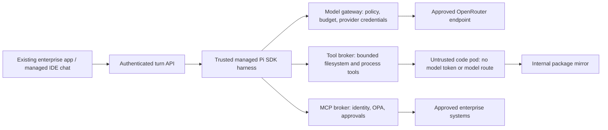

# Enterprise hardening: productive sandboxes with enforced boundaries

**The local lab is suitable for controlled prototyping, not yet a production multi-user deployment.** It has enforced container, network, file and model-gateway controls. It does not have Entra authentication, production MCP/OPA enforcement, DLP, or a trusted remote Pi execution broker. Those are explicit rollout gates, not features an agent prompt can supply.

## Language and package decision

The existing set covers the stated work: Python, JS/TS, C#/.NET, Julia, Go, Rust, C/C++, and shell. Do not enlarge every image speculatively. Add Java/Kotlin, PowerShell, or R as versioned optional images when a team needs them; consider DuckDB for local SQL analysis. Windows-only .NET Framework, WPF, COM and Windows desktop applications need a separate Windows development lane, not these Linux containers. Browser-based .NET/Node/Go/Python apps remain suitable here.

| Environment | Missing package | Isolation and restore |
|---|---|---|
| Quick Python | **No runtime download today.** An unavailable import causes delegation to a Coder project. uv is installed, but this pod intentionally has no package/network route. | Fresh interpreter and writable filesystem every execution; bounded conversation files restore locally. No shared writable site-packages, installed packages or Python variables survive. |
| AI project | Use `uv init`, `uv add <package>`, `uv sync --locked`, `uv run …` within the project. Existing virtual environments can use `uv pip`. | Per-project home/venv and lockfile; package gateway enforces the five-day gate. Projects do not share writable environments. |
| Human workspace | Same package managers and restricted package egress, with VS Code/terminal and an additional model route. | Its own home/PVC, package caches, settings and session history. Separate from all chat execution. |
| Trusted application/images | Backend uses uv and `requirements.lock`; image builds use uv. Frontend uses `npm ci`. | Reviewed build pipeline, not model-controlled installation. Bootstrap/image downloads are trusted administrator actions. |

Python/npm/NuGet/Cargo publication dates are enforced by the gateway; Go/Julia use conservative first-observed quarantine where publication evidence is insufficient. All valid package names are eligible, including transitive dependencies: **there is no package-name whitelist**. Human exceptions are exact package/version entries with expiry. Editing uv/npm settings inside the container cannot weaken the gateway. Already admitted code can still be malicious; a five-day delay is not malware detection. C/C++ OS libraries and unsupported Conan/vcpkg feeds require an image change today. Toolchain upgrades also belong in the image pipeline.

To add packages without promoting quick work later, introduce a **trusted dependency resolver**: accept package specifications, resolve and lock with uv against a read-only enterprise mirror, scan and cache wheels by digest, then mount/copy the approved environment into a new quick pod. Key caches by Python ABI, platform, image digest and lockfile digest. Give each conversation its own manifest and each execution its own writable layer. Compile source distributions in a separate bounded build sandbox without credentials, not in the resolver control service. Do not give quick code internet access or a writable global Python environment merely to make installation convenient. This resolver lane is a proposal, not implemented here.

## Threats and current controls

| Threat | Enforced locally | Remaining gap / production action |
|---|---|---|
| Host file deletion / container escape | No host mounts, Docker socket, host namespaces or service-account token; non-root, dropped capabilities, seccomp, restricted admission, read-only root. | Containers share a kernel. Validate an AKS-supported hardened runtime/node boundary and patch nodes. Local host administrators remain trusted. |
| Deleting project files | Separate home/PVC; other homes not mounted. | Pi can delete its own project. Keep versioned checkpoints and backups outside the sandbox's write/delete authority. Git alone is insufficient if the agent can erase `.git`. Test recovery and retention. |
| External connections | Default-deny network policy; internal-only DNS; fixed package/model routes. Quick pods have no egress. | Test IPv4/IPv6, DNS, metadata endpoints, redirects, Coder forwarding, preview resources and node routing on the exact AKS CNI. Gateways themselves are trusted egress services. |
| Sensitive model data | Actual OpenRouter key stays in trusted services. Chat, title generation and gateway requests force `provider.zdr=true` and `data_collection=deny`. | Approved transmission still sends data. Confirm account-level logging settings, contract, model/provider eligibility, region and data classes with the organization. Fail when no eligible provider exists; do not silently relax privacy. |
| Search disclosure | Gateway fixes the Exa server tool and its result/use limits. Trusted `LAB_ALLOW_WEB_SEARCH=false` removes server search; workspaces cannot override it. | User reports Exa ZDR/agreements; the lab cannot verify those contracts. A query can contain sensitive data even with ZDR. Classified projects may need search disabled or query approval/redaction in a separate trusted tool. |
| Package channel abuse | Registry-only read paths, age gate, bounded downloads, artifact hash checks, no CONNECT/upload/publish; no external DNS from code. | Arbitrary package-name lookups can encode data sent to registry metadata services. Production should serve an internally ingested mirror/catalog and never forward arbitrary workspace lookup strings to the public internet. Scan install hooks and run them without credentials. |
| Unapproved enterprise writes | No enterprise MCP/DB routes or credentials are supplied today. | This is absence of access, not enabled OPA protection. Connect systems only through authenticated, enforcing services with operation-level privileges. |
| Credential reuse for DIY agents | Capabilities fix model, audience and lifetime; the provider key is central. No message-count restriction remains. Quick code and native Coder headless code have no model capability/route. | **GUI Pi (and the alternative Ori/Pi headless engine) shares a Linux user with code: code can read/reuse its capability.** It is not “Pi-only.” Separate the managed harness from user-controlled code before promising this restriction. Local counters are not a distributed spending system. |
| Browser/session theft | App/HTML previews are isolated, credential-stripped, sandboxed origins; ownership/session/CSRF checks guard control APIs. | Human IDE requires a different, more capable origin. Production needs independently authenticated preview/IDE routing, short-lived grants and adversarial browser tests. |
| Resource/cost abuse | CPU/memory/PID/time/concurrency and namespace limits; bounded model calls and token output; idle reaper. | Enforce tenant and user budgets centrally, including backend chat/title calls. Add durable admission, queue limits, cancellation and organization-level spending ceilings. |

OpenRouter's per-request ZDR setting restricts routing to eligible endpoints; it is not a ban on processing or disclosure. Provider policy and search policy are separate. [OpenRouter ZDR](https://openrouter.ai/docs/guides/features/zdr), [provider routing](https://openrouter.ai/docs/guides/routing/provider-selection).

The unused native Coder model adapter has been removed. Re-running `configure_agents.py` disables its old provider and clears that provider’s stored key; Coder workspace provisioning and Pi/Ori remain in use. This closes a separate model route that did not enforce our gateway privacy settings.

## The important Pi boundary

Pi's documented approach is a container or custom extension confirmation flow; it does not provide a built-in administrator-locked permission popup system that solves this deployment. Its SDK supports replacing tools and its RPC interface supports external UIs. Extensions can implement useful local friction, but user-editable settings, wrappers, extensions and code running as the same user are not tamper-resistant authorization. The shipped wrapper disables automatic extensions/skills/context loading as a baseline; this is not an administrator policy boundary. [Pi documentation](https://github.com/badlogic/pi-mono/tree/main/packages/coding-agent).

A command-name blocklist or intercepting `rm` is not enough: Python, package hooks, compiled binaries and direct sockets can perform the same actions. Neither Ori, hiding a key in a file, nor checking a client User-Agent proves that a request came from an approved agent. Pi's process is also exposed to untrusted tool output, repository instructions and dependency content; treat prompt injection as expected.

For the requirement **“users cannot build their own agents using our model access”**, use this production arrangement:

The harness pod gets no user-writable volume, repository extensions, package hooks or local execution tool. Replace Pi's read/write/edit/bash tools with RPCs into the execution pod, and enforce output/time/path bounds at the broker. Store model and enterprise credentials only in trusted services. Restrict model-gateway ingress to the managed harness identity; deny it entirely from code/IDE/app hosting namespaces. The IDE chat talks to the turn API with user identity, not a provider capability. A sidecar in the **same pod** is not sufficient network/process separation; use separate pods and identities.

The turn API is itself a capability: apply user entitlements, quotas, rate limits, managed session ownership, action schemas and audit. A determined authorized person may still automate the allowed chat workflow; you can prevent raw LLM access from the sandbox, not prove human intent from arbitrary natural-language prompts. Do not market a UI route as an unautomatable security boundary.

Coder remains the workspace control plane. Ori can remain the managed harness launch/configuration layer; neither replaces the authorization broker. This remote-tool design requires integrating the Pi SDK/tools and adjusting Pi Chat's transport. **The GUI Pi/RPC loop remains in-workspace. Native Coder headless inference already runs separately in its control plane.** Keep it for evaluation, without production credentials or a claim that arbitrary model calls are impossible.

The concrete [managed Pi design](MANAGED-PI-DESIGN.md) adds two essential requirements: no Pi-service token in the workspace's VS Code extension host, and no model access through generated browser code. Use a trusted portal chat pane outside the IDE origin, broker every execution tool with a clean environment, and block code access to the turn API as well as the model gateway. Administrator-owned authoring policy and final-artifact review address prohibited LLM integrations; they cannot prove the absence of arbitrary disguised code. Runtime isolation supplies the stronger guarantee that generated code cannot use the platform's model access. Normal local ML and analysis remain available.

## Make productive enterprise access an explicit product feature

| Lane | Useful work allowed | Data/write controls |
|---|---|---|
| Business sandbox | Build an app, visualize data, run analysis, create files. | Synthetic/sample data or approved extracts; no direct enterprise credentials. Publish/share is separate from preview. |
| Governed analysis | Query an approved dataset using named, bounded MCP operations. | Per-user row/column/data-class rules, read-only DB transactions, max rows/bytes, timeouts, export/DLP policy. “SELECT only” string parsing is insufficient. |
| Assisted business operation | Propose a typed change such as adjusting one inventory item. | Dry-run shows exact target and before/after values in trusted UI. Independent approval bound to parameters/version; transactional commit, idempotency and audit. |
| IT development | Complex multi-language projects, dev/test systems and CI. | Project/role entitlements; secrets supplied to narrowly scoped services, never broad production access in the workspace. |
| Production change | Release an app or perform a privileged operation. | Reviewed build/deploy pipeline or change workflow. Separate approvers; short-lived execution privilege; no raw SQL or broad shell access to production. |

Favor narrow tools (`inventory.adjust`, `ticket.create`) over universal `execute_sql`, `http_request` or “run any command on production.” Permit business users to draft changes quickly while withholding commit authority. A preview or “app created” status must not auto-publish an enterprise application with a privileged service identity.

## Passing identity and OPA decisions to Pi

Pi does not need to understand or obey an OPA rule for enforcement to work. The **policy enforcement point** must guard the actual destination operation, including direct alternate routes.

1. Authenticate user and workload independently. Validate token issuer, tenant, audience, expiry and authorized client. Resolve subject, project membership and tool grants server-side. A model cannot choose another user in tool arguments.
2. Build policy input from the trusted catalog: tool/version, effect, environment, target resource/data class, normalized parameters, row/byte limit, user entitlements and request provenance. Preserve user attribution across background jobs. Use per-job delegated context; never swap in an unrestricted service account after sign-in.
3. Query OPA over an authenticated trusted channel. Deny on false, undefined, stale policy, timeout, malformed response or unavailable approval service. A decision should include policy/version/reason information for audit, without echoing secrets.
4. For writes, first produce a dry-run operation plan. A trusted inline chat approval records exact action hash, user/project/tenant, destination, expiry, expected resource version and authorized reviewers. Chat/tool output cannot issue its own approval. Require a fresh decision immediately before execution.
5. Atomically consume the approval nonce, check current version/entitlements, enforce limits at the destination transaction, then commit with an idempotency key. Reconcile unknown outcomes; do not automatically replay a timed-out destructive operation. Policy evaluation alone does not prevent concurrent approval reuse.
6. Return only the result the user may see to Pi. Log decision IDs and minimal audit metadata. Redact approval content, tokens, raw queries and datasets in logs. Add revocation, a kill switch, and restore tests.

[The runnable Rego example](../infra/policy/README.md) illustrates deny-by-default reads/writes, project/tenant checks, independent approvals, replay flags, action hashes, version checks and stricter production/delete rules. It is **not wired into the app**, because there is no enterprise MCP connection yet. Reuse your existing enforcing MCP servers/OPA infrastructure rather than depending solely on a new app-side check. App checks improve UX and defense in depth; server checks cover Pi, other agents and non-chat clients alike.

Use API Center as the approved catalog source and a gateway/broker as the enforcement point. A catalog alone does not authorize calls. Do not pass incoming MCP bearer tokens through to arbitrary downstream services: use appropriate delegated/OBO flows or separately scoped destination identities. [MCP authorization](https://modelcontextprotocol.io/specification/2025-06-18/basic/authorization), [OPA decision-log masking](https://www.openpolicyagent.org/docs/management-decision-logs).

## Pilot acceptance criteria

Start with no production-write tools and approved data classes only. Demonstrate blocked direct DB/cloud metadata/public internet/model access from code, correct cross-user isolation, rejection of forged/stale/replayed approvals, and rollback/restore after destructive sandbox actions. Test a hostile repository and malicious package hook, not only friendly chat prompts. Prove audit attribution and revocation survive background execution, scaling, refresh and reconnect.

Monitor queue delay, readiness latency, cost, denied operations and storage growth without retaining sensitive tool payloads by default. Scale execution capacity down independently from storage and trusted controls. See [Azure implementation](AZURE-IMPLEMENTATION.md), [AKS scaling](AKS-DRAFT.md), and [GitHub preparation](GITHUB-READINESS.md).

## Two enterprise entitlements

Keep “use AI coding tools” distinct from “build AI applications.” Native headless code gets no platform inference credential. Authorized AI application builders obtain a separate project/application credential through Entra-governed provisioning, with its own budget, model/data policy and revocation. Never silently copy the coding-tool capability into generated apps. For the retained GUI workflow, monitor and review model usage/source because its capability remains reusable; the lab does not yet implement an enterprise classifier or Entra entitlement service.
