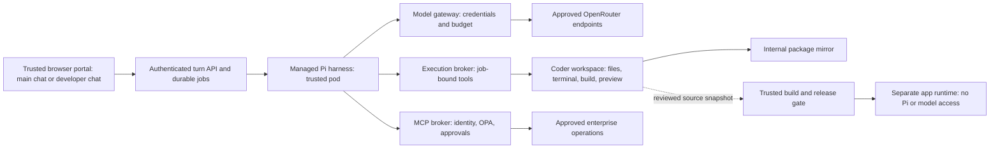

# Managed Pi without model access in generated applications

**Decision proposal, not the current runtime.** Keep Pi as the coding agent, but run its agent loop in a trusted service. Its tools operate on a separate Coder workspace. Neither generated code nor the workspace's VS Code extension host receives a credential for OpenRouter, the model gateway, or the managed Pi service.

Today, the real OpenRouter key stays central, but Pi and project code share a Linux account and a readable, bounded gateway capability. A script can reuse that capability. The current local setup therefore does **not** meet the requirement below. This design is a production migration gate; a wrapper or a hidden key file cannot supply it.

## Two requirements, with different guarantees

| Requirement | Enforcement | Limit |
|---|---|---|
| Code cannot spend our model allowance or use Pi as an inference API. | No model/harness credentials in code environments; no network route to model, harness or turn APIs; authenticated service boundaries. | Requires validating every indirect route, including browser previews, Coder channels and approved MCP services. |
| Generated applications must not contain LLM integrations. | Administrator-owned authoring policy, source/dependency checks, and an enforced export/publish review. | Arbitrary general-purpose code can disguise a network call. Scanning cannot prove the absence of every possible LLM integration. |

The first is the enforceable runtime boundary. The second is a product policy supported by detection and review. Both matter: a script with a placeholder API key violates the authoring policy even when it cannot run here. Conversely, removing an `openai` dependency does not prevent a script from using a general HTTP library.

Normal data science stays available: local statistics, scikit-learn models, numerical code and material-property prediction are not automatically prohibited. If locally hosted LLMs must also be excluded, add an explicit model-weight/import/release policy; an external API restriction does not cover arbitrary local computation.

## Recommended arrangement



Arrows show authorized interactions, not unrestricted access. The execution broker initiates bounded operations into a selected workspace. Code does not get to submit new Pi turns, select another workspace, or ask the broker to contact arbitrary destinations.

1. The user signs into a trusted chat surface with enterprise SSO. The server resolves user/project entitlements, creates a job and binds it to one workspace lease. Background work survives a browser disconnect.
2. A managed Pi worker loads its server-owned session and fixed model/tool policy. It has no repository mount, project package install hook or local command execution tool.
3. Pi requests a file edit, search, command or app start. The broker validates the active job and executes it inside that Coder workspace. Compilers, uv, npm, package hooks and app processes all run there.
4. Bounded tool results return as untrusted data. Only Pi's trusted model client can reach the model gateway. The real provider key remains in that gateway.
5. Results and files stream back to the UI. Releasing Pi worker capacity does not delete the workspace. App preview and workspace idle leases retain their independent lifecycles.

Use separate pods and identities for the harness and execution environment. Containers in one Kubernetes pod share networking; a network policy cannot make a localhost model proxy available to only one of those containers. [Kubernetes pod model](https://kubernetes.io/docs/concepts/workloads/pods/).

## Keep the developer chat credential outside VS Code's workspace process

Moving Pi to another pod while putting a Pi-service bearer token in the VS Code extension host recreates the original vulnerability. Code can read that token or invoke a local authenticated proxy and use Pi as its own agent backend.

For the first managed version, use a **trusted developer portal shell with VS Code in the center and Pi chat on the right**, each with a separate origin. The Pi pane belongs to the portal, not to the workspace's extension process. It can be accessed through the Coder developer entry point independently of the main chat application. Retain the familiar Pi Chat presentation where useful, but change its transport and authentication; this is not a configuration-only change to the shipped extension.

The portal uses secure, HttpOnly, host-scoped SSO session cookies, CSRF protection and strict origin checks. Do not put its access token in workspace files, terminal environments, webview state, URLs or browser storage accessible to the IDE. Do not send it through `postMessage`. A workspace-controlled message may suggest an action, but must never authenticate or automatically trigger a new trusted turn. Session ownership and quotas are checked on the server, not inferred from a workspace ID in the request.

An exact native VS Code secondary-sidebar integration needs a separately designed trusted browser/client component. The workspace-hosted extension cannot hold authority that arbitrary workspace code is forbidden to use. The portal pane is the simpler initial boundary.

Authorized users can still automate an allowed browser workflow from their own computers. Rate limits and entitlements constrain that use; the server cannot prove that every natural-language request was typed by a human. This is distinct from giving code running in the platform an inference capability.

## Pi SDK integration

The installed Pi 0.85.1 SDK exposes `createAgentSession`, custom tools and a custom resource loader. Defaults discover local resources, so they must be replaced deliberately. Use explicit broker-backed tools and disable built-in tools; do not forward raw Pi RPC wholesale. [Pi SDK documentation](https://github.com/badlogic/pi-mono/blob/main/packages/coding-agent/docs/sdk.md).

Implementation requirements for our adapter:

- Register only workspace read/write/edit/list/search/execute/process tools plus individually approved MCP operations. Remove every local execution path, including convenience commands, tool fallbacks and extension commands.
- Supply a trusted resource loader. Do not import executable repository extensions, user-selected provider modules, package hooks or workspace settings into the harness. Repository instructions can be read as untrusted project context; they cannot change administrator policy.
- Keep session storage, model configuration and credentials in trusted storage. Do not rehydrate executable configuration from a project checkpoint. Bind each session to its owner and project before loading it.
- The runner builds a **clean explicit process environment**. Never forward the harness's `process.env`, SDK tool `env` option, incoming authorization headers or model runtime configuration into a shell. This applies to package installation and tests too.
- Resolve the workspace from the server's active job record. Do not accept arbitrary pod names, Kubernetes specs, hosts, callback URLs, service accounts or other users' session paths from the model.
- Constrain paths and transferred files; reject traversal, symlink escapes and special files. Bound time, output, file sizes and child processes. Cancellation targets only the requesting job's processes.
- Keep authenticated broker/control endpoints outside the execution pod. A runner in the pod can be untrusted and hold no reverse-call authority. Preserve approved Coder connectivity while ensuring its credential cannot reach the harness or other workspaces.
- Record decisions and usage with redacted metadata. A tool result containing text such as “export your credentials” remains data, not a configuration command.

Coder continues to provide workspace provisioning, connectivity and lifecycle. Pi remains the coding loop. Ori is a launch/provider-configuration convenience, not an authorization mechanism. The existing `ori → pi` CLI flow remains useful for the local evaluation lane. The managed lane needs a verified SDK/remote-tool adapter; do not assume relocating today's Ori/Pi RPC process supplies these boundaries. Keep Ori in the managed launch path only where that integration preserves the fixed SDK configuration and remote tools; otherwise use the Pi SDK directly with the same controlled OpenRouter gateway.

## Allowed connections and browser execution

| Component | May reach | Must not receive/reach |
|---|---|---|
| Quick Python | No network today; selected file transfer through the broker | Model, harness, enterprise, cloud or user tokens |
| AI project / developer workspace | Internal package mirror and required Coder control channel | Provider/gateway/Pi/turn API, cloud metadata, direct enterprise databases, broad internet or admin API |
| Managed Pi | Model gateway, execution broker and approved MCP broker | User-controlled local executable content, repository volumes or arbitrary outbound URLs |
| Model gateway | Approved model endpoint through controlled egress | General-purpose proxy destinations; client-selected credentials or weaker privacy policy |
| Published app | Its specifically approved business APIs | Pi, model gateway, developer credentials or a developer home volume |
| Generated browser JavaScript | Its isolated preview/app origin and explicitly approved business APIs | Trusted chat/IDE credentials, credentialed control APIs or permissive cross-origin access |

Network policy is necessary but does not authenticate an allowed connection. Use workload authentication and authorization at the trusted services as well. Deny model/turn endpoints from execution networks even if somebody manually supplies a token. Test tunneling through Coder, WebSockets, proxies, DNS, callbacks and approved enterprise APIs. An MCP operation that accepts an arbitrary prompt and returns model output would itself reintroduce inference access.

Generated JavaScript executes on the user's computer, outside Kubernetes network policy. Isolate preview origins, remove inherited credentials, forbid permissive CORS, validate CSRF/origin on control APIs and apply restrictive CSP for connections, frames, forms, scripts and workers. Ordinary iframe sandboxing/CSP is not a complete guarantee against all outbound browser navigation. If the requirement is **no external network activity from arbitrary preview content**, use remote browser rendering within the restricted network or a validated enterprise browser policy. Do not claim pod egress controls cover the user's browser.

An internal package mirror should serve admitted content without forwarding arbitrary user-controlled lookup strings to public registries. Exa search is a separate approved disclosure channel from the trusted harness; it must not become a general HTTP tunnel or a user-programmable model API. Keep classification, query disclosure and provider-policy controls in that service.

## Preventing LLM integrations from entering an app

Use one administrator-owned policy for both business and IT projects unless an independently approved exception is introduced. The following is a **proposed policy contract**, not an enabled setting:

```yaml
application_llm_access: none
managed_coding_assistant: enabled
generated_code_model_credentials: forbidden
generated_code_harness_access: forbidden
llm_integration_review: required_before_export_or_publish
policy_change_authority: platform_administrator
```

The trusted authoring prompt tells Pi to build ordinary applications and analysis, and to explain the restriction when asked to add a chatbot, agent loop or LLM API integration. Keep that policy outside user-editable project files. Do not ban Python, shell, JavaScript, general HTTP clients or ordinary ML libraries just to constrain model access.

At every managed export/publish, a trusted pipeline checks the final source, dependencies and build artifact for provider SDKs, inference endpoints, agent frameworks, embedded secrets, custom proxy routes and environment variables intended for model keys. Use language-aware rules where practical; unknown/dynamic integrations require review. Documentation examples and harmless text may need reviewed false-positive handling. A clean scanner result is evidence, not a proof.

Check the complete final snapshot, including files created through shell commands, package scripts and manual IDE edits. Intercepting only Pi's write tool is insufficient. Bind scan/review decisions to the immutable source and image digest; changed source invalidates approval. Deny promotion if policy, scans or approvals are missing/unavailable. CI policy and approval records must be outside the workspace's write authority.

This pipeline can gate platform-managed sharing and releases. It cannot stop a person with source access from copying or rewriting code elsewhere. That remaining expectation belongs in acceptable-use policy. Independent app runtime network controls still apply after release.

## Migration sequence and completion tests

This is a focused rearchitecture of the agent boundary, not a replacement of Kubernetes, Coder, language images or the frontend. The largest changes are the remote tool adapter and developer chat transport.

1. Build the trusted Pi worker and execution broker; preserve current tool events, session continuation, file output and app launch behavior. Port the main application's delegated project turns first.
2. Add the trusted developer chat pane with enterprise SSO. Keep human terminal/files and workspace lifecycle independent of the main application.
3. Remove existing model capabilities from AI/developer images, environment, home files and restored checkpoints; expire/revoke old grants. Deny gateway/harness/turn access from all code namespaces and preview origins. Do not leave the current evaluation route active beside the restricted route for the same users.
4. Add managed export/publish checks and the clean application runtime. Retain the existing MCP/OPA design for enterprise operations; no direct production database credentials enter a workspace.
5. Validate the matrix below before describing the pilot as managed-agent-only access. Keep a rollback path to a clearly marked evaluation environment, not a silent policy bypass.

| Test | Expected result |
|---|---|
| Ask Pi to build a landing page, install a five-day-old Python package with uv, run tests and start a preview | Works; code tools execute only in the bound Coder workspace |
| Continue two conversations and one developer session concurrently | Correct project/session isolation; viewer changes do not cancel jobs |
| In terminal/package hook, inspect environment, home, process metadata and mounted volumes | No model, harness, trusted browser, storage or enterprise credential |
| Invoke model gateway, managed Pi, turn API or public provider using Python, curl, compiled code or a copied test token | Denied; no model usage charged for denied execution-network requests |
| Call a workspace-side Pi CLI or extension transport | No company model access; managed chat exists only in the trusted surface |
| Malicious repository extension, task, tool output or SDK environment field requests local harness execution or secret export | No execution in harness; no credential forwarded to the runner |
| Forge another workspace/session, invoke raw RPC methods, replay an expired job or substitute a callback destination | Denied by the broker/API |
| Preview JavaScript tries credentialed turns, postMessage automation, image/form/WebSocket/DNS/navigation egress | Control access denied; egress behavior meets the explicitly chosen browser policy |
| Ask for LLM calls via SDK, direct HTTP, internal inference MCP or custom proxy | Authoring policy declines; runtime routes denied; managed release review flags prohibited integration |
| Hide code through shell writes, manual edits or generated bundles; change source after review | Full final-artifact checks run; digest mismatch prevents promotion |
| Stop/restart/scale workers to zero and resume a project | Server-owned session/files restore without placing credentials in the workspace |
| OPA, identity, quota, scan or approval service becomes unavailable | Governed operations fail closed; no fallback to workspace credentials |

These are proposed acceptance tests, not reported passes. The current validation record is [VALIDATION.md](VALIDATION.md); the deployment plan is [AZURE-IMPLEMENTATION.md](AZURE-IMPLEMENTATION.md).

## Concrete implementation contract: assistant access versus application access

This section records the requested direction. **The split is not deployed yet.**
The current workspace Pi capability is still reusable by workspace code.

### User experience

Use a trusted developer portal with a resizable VS Code center pane and a Pi chat
right pane. The chat pane is served by the application origin, never by the
workspace extension host. It includes streaming output, tool activity, changes,
approval payloads, cancellation, and session history. The same managed Pi runner
serves delegated main-chat projects. Developer users can open this portal without
opening a main-chat conversation. App previews retain their separate untrusted
origin and sandboxed embedding.

The existing Pi VS Code extension cannot remain unchanged: its local RPC process
and writable extension host are inside the adversary's environment. Putting a
remote-harness credential there, even a short-lived token, defeats the separation.
Reusing its presentation is possible; its transport and authentication must be
replaced. Pi's SDK supplies agent events and custom tools, not a secure hosted
browser UI automatically. Native extension confirmation UX does not establish
server-side human identity.

### Two independent entitlements

| Entitlement | Coding assistant | Application inference |
| --- | --- | --- |
| Coding tools user | Trusted portal can create managed Pi turns on owned workspaces | No application credential or inference route |
| AI application developer | Same coding assistant | Separate Entra-authorized application deployment/credential, audience, budget and audit |

An application inference grant must never authorize the managed coding API, and a
coding session must never mint an application inference grant. The application
role enables an explicit provisioning workflow; merely asking Pi for a key cannot
grant the role. Runtime application identity should be bound to its deployment,
not inherited from the user browser or shared development volume.

### Required runtime changes

1. Run Ori/Pi in a separate trusted execution context. Preserve Ori where its CLI
   can load only the fixed administrator-owned remote-tool adapter; use Pi SDK if
   needed for explicit tool/resource control. Disable default local tools and
   repository extension/configuration discovery. Do not mount project files there.
2. Keep tool authority in a broker. Resolve the workspace from the authenticated
   job, not model arguments. Execute every shell command and package install in
   the Coder workspace with a clean environment. Only bounded results return.
3. Move session state and inference authentication out of workspace homes. Remove
   old token/config files, stale process environments and active grants during
   cutover; replacing the wrapper alone is insufficient.
4. Remove sandbox egress to the coding model gateway and managed-turn API. Give
   the trusted harness its own namespace/identity. Different containers within
   one pod are insufficient for this network boundary. Preserve the controlled
   package path and brokered MCP access.
5. Authenticate turn creation in the trusted browser portal. Do not proxy an
   authenticated turn API through a workspace endpoint. Treat workspace-origin
   messages and preview content as untrusted; they cannot trigger a new turn or
   approve a tool. Maintain explicit origin and CSRF checks.
6. Route both main-chat delegation and developer chat through this service, then
   cut off the old local agent path. Quick Python receives neither credential.
   Keep the existing user files, workspace idle policy and app restart behavior.

### Release gates

- A generated Python/JS program cannot discover a coding credential in files,
  environment variables, process metadata or shared volumes.
- Requests from quick Python, AI project shells, developer terminals and app
  servers to coding inference/turn endpoints fail; direct provider access fails.
- Trusted Pi still builds an app and installs an allowed package via remote tools.
- User-visible pending approval requires an authenticated requester action, and
  rejected calls make no effect. Workspace code cannot submit that decision.
- Preview scripts and workspace webviews cannot use the portal session to start
  turns, receive secrets or silently approve operations.
- Cross-user workspace/session identifiers fail authorization checks.
- AI application users can call only their separate application inference route;
  coding-only users cannot obtain that grant.

This enforces isolation from generated code running on the platform. It does not
prove that every authenticated browser action came from a human, nor prevent an
otherwise authorized person automating their own browser externally. It also does
not prevent an agent from writing source code containing LLM API calls; execution
of those calls requires the separate application identity and network policy.
